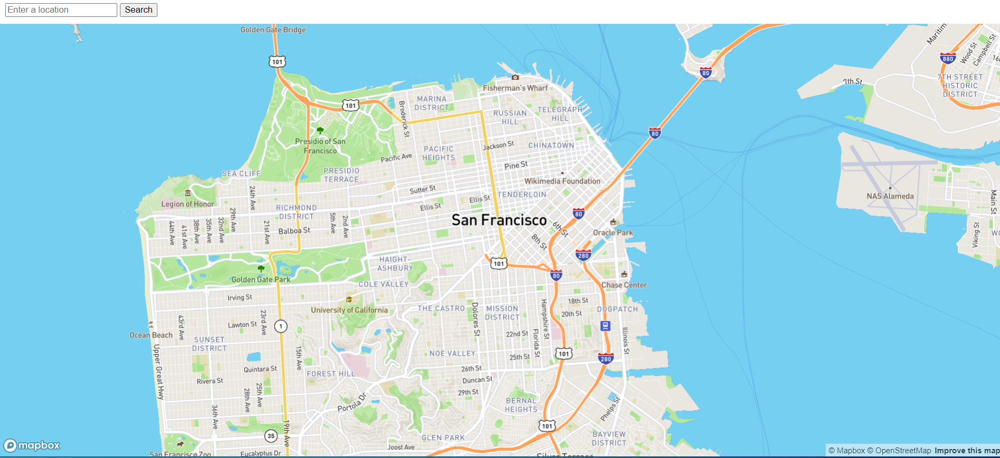

# Food Truck Finder App

A Flask application that uses Mapbox and the Mobile Food Facility Permit dataset from DataSF to provide information about food trucks near a specific location., and includes tests.

  

## Technologies

- Python
- Flask
- Mapbox
- JSON

## Setup

- Clone the project: `git@github.com:rOluochKe/food-truck-finder.git`
- Change directory into : `cd /food-truck-finder`
- Create your environment and install dependencies: `pip install -r requirements.txt`
- Get api token for `MAPBOX_ACCESS_TOKEN` and `YOUR_DATASF_APP_TOKEN`
- Run app: `python app.py`
- Run tests: `python tests.py`
- View api on: `http://127.0.0.1:5000/`
